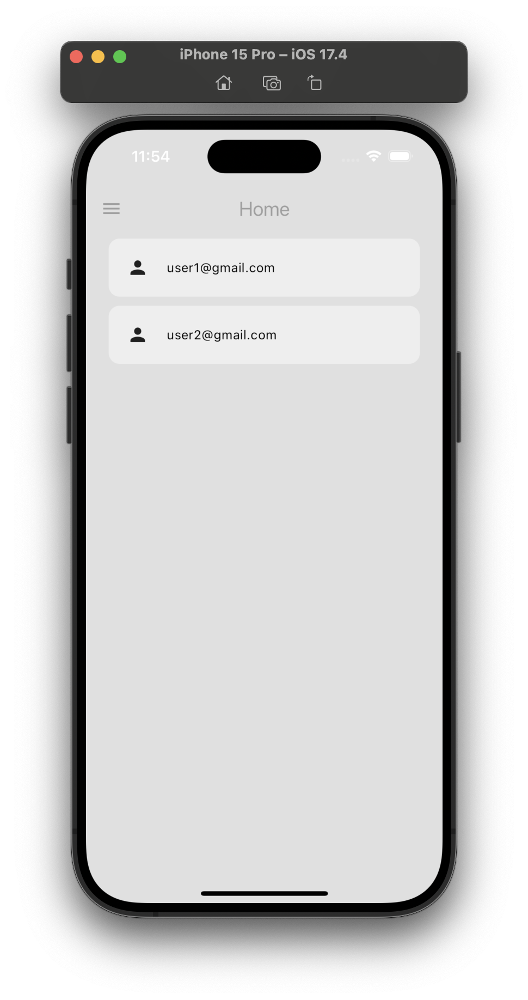

# minimal_chat_app

> Dự án này tham khảo từ nguồn: https://www.youtube.com/watch?v=5xU5WH2kEc0
>
> ---
>
> Các tài khoản đã tạo để test:
>
> Tester:
> - Email: test@gmail.com
> - Pass: 12345@
>
> User1:
> - Email: user1@gmail.com
> - Pass: user1@123
>
> User2:
> - Email: user2@gmail.com
> - Pass: user2@123
>
> ---
>
> Các tính năng:
> - Chế độ Light mode và Dark mode
> - |
> - Đăng ký tài khoản mới.
> - Đăng nhập tài khoản cho lần đầu tiên.
> - Tự động đăng nhập nếu đã có tài khoản.
> - |
> - Tạo chat room giữa 2 người dùng
>
> ---
>
> ||||
> |-|-|-|
> ||||
> ||||